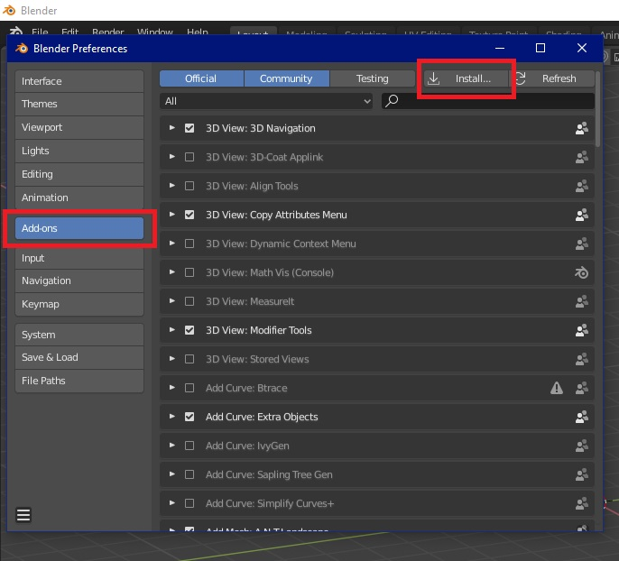
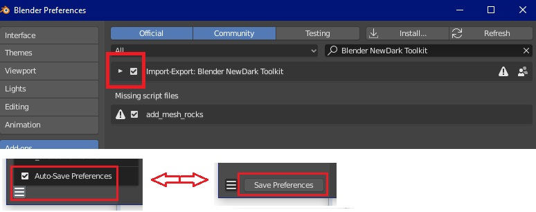
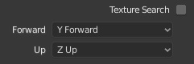
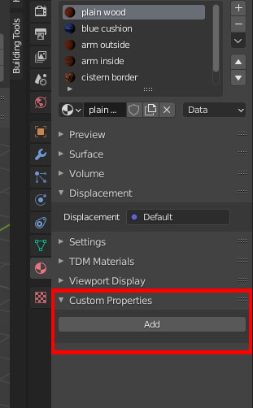
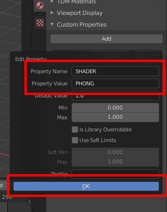
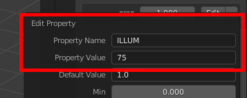
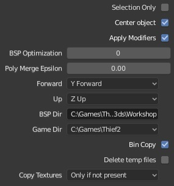
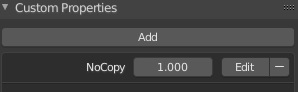

# Blender-NewDark-Toolkit
Update to Telliamed's Blender Toolkit for .e files (see [the original version](https://www.ttlg.com/forums/showthread.php?t=136431) for motion tools). This now exports .bin files (path to BSP.exe required), and images are now only converted during import (to make them Blender compatible). The code for .bin export has been adapted from the Elendir's Dark Exporter 2 addon.

This addon does three things:
- Import .e files
- Export .bin files for objects (uses **BSP.exe**)
- Export .bin and .cal files for AI meshes (uses **MeshBld.exe**)

The objects textures can be copied to the /txt16 folder, but you can choose the conditions and make exceptions.

## Installation
Use the **Clone or Download** button and slect **Download as ZIP File**

In Blender, go to Edit > Preferences > Install: 

Enable the addon, and at the bottom left check that Auto Save Preferences is eanbled. If not, use the Save button to remember the setting: 

## Using the addon

### Import
Go to File > Import and select **E file** and select the file. 

There are two options: 
**Texture Search**: When unchecked, Blender will expect the textures to be in the same folder as the .e file. When checked, it'll also search in any subfolders. If you've used User Preferences to set a Textures Directory, the addon will also look in there (and subfolders again). This is useful if you want to use a library of textures to use on multiple objects, or as a place to store stock textures that have been extracted from the .crf files.

**Forward** and **Up** axes: These specifiy the orientation of the objects. The default values should be fine unless an .e file was generated by some other means than bintoe which gave the object the wrong orientation.

### Material Settings
**Custom properties** are used to set material properties to improve the look of the object.* 

For any custom property got to Add, then Edit and set the following names and values:

#### Smooth/sharp shading:
For smooth shading, name: **SHADER**, value: **PHONG**. It will look like this: 
 
Any other value will cause flat shading to be used. Flat shading will also be used if there is no **SHADER** property.

#### Illumination
For glowing materials, name: **ILLUM**, value: 0 - 100. Default is 0 
 
A bright light would be 100. Consider using lower values for weak lights, such has glowing biological things. Brightnesses can be modifed in Dromed using the Renderer > Self Illumination property (decimal, 0 - 1). Not confirmed at time of writing but I think it multiplies all 'ILLUM' material brightness values, up to a point.

#### Transparency
Name: **TRANSP**, value: 0 - 100 
 
0 = fully opaque (default), 100 = fully transparent.

#### Double Sided
Not currently implemented, but I'm not sure why as it looks like 'DBL' just has to be written to the .e file. Planned for an update in the near future!

*Blender materials have many properties of their own but very few could possibly correspond to Dark Engine material properties. And different shader types have different properties, so it was decided for consistency and simplicity to use Custom Properties for everything to keep things in one place.

### Export
Go to File > Export > Bin File. No need to navigate to your obj folder (file copied as per options below). 

**Selection Only**: When unchecked, every visible object will be exported. When true, only the selected object will be exported.

**Center Object**: Whether or not the object's bounding box is centered about 0,0,0. Recommended for most objects.

**Apply Modifiers**: Modifiers are a good way of performing non-destructive changes to a model (e.g. mirroring certain parts).  Recommended.

**BSP Optimization**: This affects how BSP tries to merge triangles or split them when they intersect. 0 is recommended so that what you see in Blender is as close as possible to the result in game.

**Poly Merge Epsilon**: This also affects how triangles are merged (or not merged). During development of this addon it was found that 0.00 should be used to give the user full control over the appearence of the object, but try other values if you get strange gaps in the exported object.

**BSP Dir**: The full path of the folder containing "BSP.exe".

**Game Dir**: Game or FM folder where objects will be extracted to. Currently it only uses obj. Mesh is planned for a future release. Note that you can choose from a list (see the **Setup** section for setting up the list). The addon will automatically add "\Obj" to the selected path.

**Bin Copy**: Copies the exported file to the \Obj\ folder.

**Delete temp files**: Before copying, the .bin file is created in the same folder the Blender object is saved in. This option deletes it when the copying is finished. Don't select this if **Bin Copy** is unselected otherwise you won't get any export file.

**Copy Texutres**:
- **Always** (textures will be copied to obj\txt16 and existing files will be overwritten)
- **Only if not present** (existing files won't be overwritten - this is recommended because an existing object may use a texture that has the same but that looks vrey different to the one for your object. When you see your object in game, you'll see that it looks different, so you'll be able to rename the texture and export again).
- **Never** (useful if your object is only using stock textures)
- A useful feature if you're using a mixture of stock and new textures: 
  - Choose one of the first two options (i.e. so that textures may be copied)
  - For an texture you **don't** want to be copied, edit its ***Material***, add "Custom Property" called **NoCopy**. A value other than 0 will prevent the texture from being copied to /txt16. 

  

**AI Mesh**
Creates an AI mesh (which will require limit planes and joint boxes) and saves it to **mesh** instead of **obj**. The menu below is for selecting the type of mesh. Humanoid will be the most common, so that's the default.

## Setting Default Values
There are several things to set up to allow the addon to work and be easy to use. In most cases it's clear which export option each varaible refers to, so this section just states valid values. All the options are all explained fully in the **Export** section of this readme.

Once the addon has been enabled, go to your Blender addons folder (%Appdata%\Blender Foundation\Blender\2.80\config\scripts) and open **Bin_Export.cfg**.

**__NOTE THE FORMAT OF EACH DEFAULT VARIABLE BEFORE MAKING CHANGES__** 
__Also note that the final variable does not end with a ,__ 
__Blender must be restarted for the changes to take effect__ 

- **autodel**: true or false
- **bin_copy**: true or false
- **bsp_dir**: Path surrounded by "s. Use \\\ rather than just \\ to separate each part of a path.
- **bsp_optimization**: 0 - 3
- **game_dirs**: Multiple paths should be separated by a semicolon (and use \\\ rather than \\). Example: "**C:\\\Games\\\Thief2;C:\\\Games\\\Shock2**" will give you this menu: 

- **centering**: true or false
- **selection_only**: true or false
- **tex_copy**: 0, 1 or 2, which correspond with menu the menu items you see during Export 

