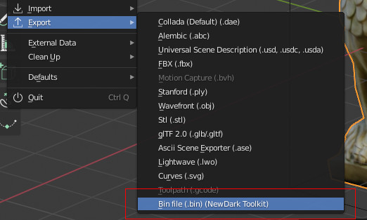

# Blender-NewDark-Toolkit
Update to Telliamed's Blender Toolkit for .e files (see [the original version](https://www.ttlg.com/forums/showthread.php?t=136431) for motion tools). This now exports .bin files (path to BSP.exe required), and images are now only converted during import (to make them Blender compatible). The code for .bin export has been adapted from the Elendir's Dark Exporter 2 addon.

## Summary and Basic Usage
This addon does three things:
- Import .e files
- Export .bin files for objects (uses **BSP.exe**)
- Export .bin and .cal files for AI meshes (uses **MeshBld.exe** and **MeshUp.exe**)

The object's textures can be copied to the /txt16 folder, but you can choose the conditions and make exceptions.

### Import
  
There are only a few Import options: 

- **Texture Search**: When unchecked, Blender will expect the textures to be in the same folder as the .e file. When checked, it'll also search in any subfolders. If you've used User Preferences to set a Textures Directory, the addon will also look in there (and subfolders again). This is useful if you want to use a library of textures to use on multiple objects, or as a place to store stock textures that have been extracted from the .crf files.
- **Forward** and **Up** axes: These specifiy the orientation of the objects. The default values should be fine if the .e file was generated by bintoe.

### Export
  
This presents you with many options: 
 

  
Click to expand options desciption...

  
- **Selection Only**: When unchecked, every visible object will be exported. When true, only the selected object will be exported.
- **Center Object**: Whether or not the object's bounding box is centered about 0,0,0. Recommended for most objects.
- **Apply Modifiers**: Modifiers are a good way of performing non-destructive changes to a model (e.g. mirroring certain parts). In most cases this should be checked.
- **Smooth Angle**: Determines the limit (angle between faces) up to which 'Phong' or 'Gouraud' shaded materials will be smoothly shaded. 120 is the default because that matches BSP's own default. Lower angle = more sharp edges.
- **BSP Optimization**: This affects how BSP tries to merge triangles or split them when they intersect. 0 is recommended so that what you see in Blender is as close as possible to the result in game.
- **Coplanar Limit**: This also affects how triangles are merged (or not merged). During development of this addon it was found that a value of 1.00 produced the best results. Other values may lead to small gaps between faces or vertices being out-of-position/merged. Note: the previous version of this addon incorrectly called it 'Poly Merge Epsilon'.
- **BSP/MeshBld Dir**: The full path of the folder containing "BSP.exe" and "MeshBld.exe".
- **Game Dir**: Game or FM folder where objects will be extracted to. Note that you can choose from a list (see the **Setup** section for setting up the list). Should be the parent folder of the \obj or \mesh folders, e.g. c:\games\Thief2 or c:\games\Thief2\FMs\SomeFMFolderName
- **Bin Copy**: Copies the exported file to the \obj or mesh\ folders.
- **Delete temp files**: Before copying, the .bin file is created in the same folder the Blender object is saved in. This option deletes it when the copying is finished. Don't select this if **Bin Copy** is unselected otherwise you won't get any export file.
- **Copy Texutres**:
  - **Always** (textures will be copied to obj\txt16 and existing files will be overwritten)*
  - **Only if not present** (existing files won't be overwritten - this is recommended because an existing object may use a texture that has the same but that looks vrey different to the one for your object. When you see your object in game, you'll see that it looks different, so you'll be able to rename the texture and export again).*
  - **Never** (useful if your object is only using stock textures)
  - *Object materials have a 'Do Not Copy' property which prevents that texture being copied, even when either of the first two options is chosen.
- **AI Mesh**: Select this when exporting a creature (things with joints/limit planes etc).
- **Mesh Type**: When the above is selected, this specifies a kind of 'template' file for the AI to ensure the mesh has all the right joints in all the right places.
- **Forward** and **Up** axes: These can adjust the orientation of the objects. Defaults should be fine.

## Material Properties
The Materials tab has a panel which shows material settings supported by the Dark Engine: 
 
- **Shader Type**: Smooth for Flat shading.
  - Phong/Gouraud: Object lighting is smoothed across adjacent faces that use this shader type. Note that the Dark Engine doesn't really use Phong. Selecting that will just lead to Gouraud being applied. Phong has always been listed however, so it's inclusion here is just for consistency.

Object Properties: 

## Installation
Use the **Clone or Download** button and slect **Download as ZIP File**

In Blender, go to Edit > Preferences > Install: 

Enable the addon, and at the bottom left check that Auto Save Preferences is eanbled. If not, use the Save button to remember the setting: 

## Using the addon

#### Smooth/sharp shading:
For smooth shading, name: **SHADER**, value: **PHONG**. It will look like this: 
 
Any other value will cause flat shading to be used. Flat shading will also be used if there is no **SHADER** property.

#### Illumination
For glowing materials, name: **ILLUM**, value: 0 - 100. Default is 0 
 
A bright light would be 100. Consider using lower values for weak lights, such has glowing biological things. Brightnesses can be modifed in Dromed using the Renderer > Self Illumination property (decimal, 0 - 1). Not confirmed at time of writing but I think it multiplies all 'ILLUM' material brightness values, up to a point.

#### Transparency
Name: **TRANSP**, value: 0 - 100 
 
0 = fully opaque (default), 100 = fully transparent.

#### Double Sided
Name: **DBL**, value: 1.0 or 1 
 
1.0 or 1 makes the material double sided in game. For any other value, or no DBL property, the material will be single sided.

*Blender materials have many properties of their own but very few could possibly correspond to Dark Engine material properties. And different shader types have different properties, so it was decided for consistency and simplicity to use Custom Properties for everything to keep things in one place.  

**AI Mesh**
Creates an AI mesh (which will require limit planes and joint boxes) and saves it to **mesh** instead of **obj**. The menu below is for selecting the type of mesh. Humanoid will be the most common, so that's the default.

## Setting Default Values
There are several things to set up to allow the addon to work and be easy to use. In most cases it's clear which export option each varaible refers to, so this section just states valid values. All the options are all explained fully in the **Export** section of this readme.

Once the addon has been enabled, go to your Blender addons folder (%Appdata%\Blender Foundation\Blender\2.80\config\scripts) and open **Bin_Export.cfg**.

**__NOTE THE FORMAT OF EACH DEFAULT VARIABLE BEFORE MAKING CHANGES__** 
__Also note that the final variable does not end with a ,__ 
__Blender must be restarted for the changes to take effect__ 

- **autodel**: true or false
- **bin_copy**: true or false
- **bsp_dir**: Path surrounded by "s. Use \\\ rather than just \\ to separate each part of a path.
- **bsp_optimization**: 0 - 3
- **game_dirs**: Multiple paths should be separated by a semicolon (and use \\\ rather than \\). Example: "**C:\\\Games\\\Thief2;C:\\\Games\\\Shock2**" will give you this menu: 

- **centering**: true or false
- **selection_only**: true or false
- **tex_copy**: 0, 1 or 2, which correspond with menu the menu items you see during Export 

