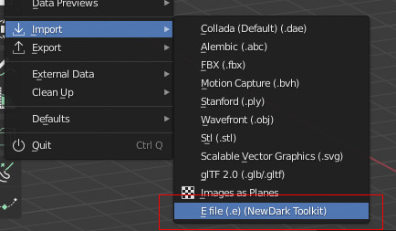
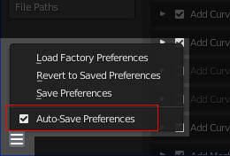

# Blender-NewDark-Toolkit
This addon allows Blender to export .bin files (Dark Engine objects and AI meshes) and import .e files (plain text files developed by LGS as an intermediate format for object conversion).

This is an update to Telliamed's Blender Toolkit for .e files (see [the original version](https://www.ttlg.com/forums/showthread.php?t=136431) for motion tools). This now exports .bin files (path to BSP.exe required), and images are now only converted during import (to make them Blender compatible). The code for .bin export has been adapted from the Elendir's Dark Exporter 2 addon.

## Requirements
  * The latest version was written in Blender 2.93. It'll probably work in 2.80 but it's best to use the latest version.
  * The LGS programs BSP.exe and MeshBld.exe. Most fan-made installation tools (e.g. T2Fix, Dromed Toolkit etc) will include these.
  * Shadowspawn's MeshUp tool (from the MeshFix pack [here](https://www.angelfire.com/games4/shadowspawn/Tools.html), or various Thief/Dromed installation packs) , which converts AI meshes to the T2 format (this allows Texture Replacement to work).
  * The template .cal files which are also used for generating AI meshes. See your copy of mesh.crf.

## Instructions
This addon does three things:
- Import .e files
- Export .bin files for objects (uses **BSP.exe**)
- Export .bin and .cal files for AI meshes (uses **MeshBld.exe** and **MeshUp.exe**)

The object's textures can be copied to the /txt16 folder, but you can choose the conditions and make exceptions.

### Import
  
There are only a few Import options: 

  
Click to expand import options description...

  
- **Texture Search**: When unchecked, Blender will expect the textures to be in the same folder as the .e file. When checked, it'll also search in any subfolders. If you've used User Preferences to set a Textures Directory, the addon will also look in there (and subfolders again). This is useful if you want to use a library of textures to use on multiple objects, or as a place to store stock textures that have been extracted from the .crf files.
- **Forward** and **Up** axes: These specifiy the orientation of the objects. The default values should be fine if the .e file was generated by bintoe.

### Export
  
This presents you with many options: 
 

  
Click to expand export options description...

  
- **Selection Only**: When unchecked, every visible object will be exported. When true, only the selected object will be exported.
- **Center Object**: Whether or not the object's bounding box is centered about 0,0,0. Recommended for most objects.
- **Apply Modifiers**: Modifiers are a good way of performing non-destructive changes to a model (e.g. mirroring certain parts). In most cases this should be checked.
- **Smooth Angle**: Determines the limit (angle between faces) up to which 'Phong' or 'Gouraud' shaded materials will be smoothly shaded. 120 is the default because that matches BSP's own default. Lower angle = more sharp edges.
- **BSP Optimization**: This affects how BSP tries to merge triangles or split them when they intersect. 0 is recommended so that what you see in Blender is as close as possible to the result in game.
- **Coplanar Limit**: This also affects how triangles are merged (or not merged). During development of this addon it was found that a value of 1.00 produced the best results. Other values may lead to small gaps between faces or vertices being out-of-position/merged. Note: the previous version of this addon incorrectly called it 'Poly Merge Epsilon'.
- **BSP/MeshBld Dir**: The full path of the folder containing "BSP.exe" and "MeshBld.exe".
- **Game Dir**: Game or FM folder where objects will be extracted to. Note that you can choose from a list (see the **Setup** section for setting up the list). Should be the parent folder of the \obj or \mesh folders, e.g. c:\games\Thief2 or c:\games\Thief2\FMs\SomeFMFolderName
- **Bin Copy**: Copies the exported file to the \obj or mesh\ folders.
- **Delete temp files**: Before copying, the .bin file is created in the same folder the Blender object is saved in. This option deletes it when the copying is finished. Don't select this if **Bin Copy** is unselected otherwise you won't get any export file.
- **Copy Texutres**:
  - **Always** (textures will be copied to obj\txt16 and existing files will be overwritten)*
  - **Only if not present** (existing files won't be overwritten - this is recommended because an existing object may use a texture that has the same but that looks vrey different to the one for your object. When you see your object in game, you'll see that it looks different, so you'll be able to rename the texture and export again).*
  - **Never** (useful if your object is only using stock textures)
  - \* Object materials have a 'Do Not Copy' property which prevents that texture being copied, even when either of the first two options is chosen.
- **AI Mesh**: Select this when exporting a creature (things with joints/limit planes etc).
- **Mesh Type**: When the above is selected, this specifies a kind of 'template' file for the AI to ensure the mesh has all the right joints in all the right places.
- **Forward** and **Up** axes: These can adjust the orientation of the objects. Defaults should be fine.

**Note**: At the time of writing, these settings don't get saved with the object. If you find yourself having to make the same changes again and again, you should edit the config file and change the default values. See the end of this readme.

## Material Properties
The Materials tab has a panel which shows material settings supported by the Dark Engine: 
 

  
Click to expand material properties description...

  
- **Shader Type**: Smooth for Flat shading.
  - Phong/Gouraud: Object lighting is smoothed across adjacent faces that use this shader type. Note that the Dark Engine doesn't really use Phong. Selecting that will just lead to Gouraud being applied. Phong has always been listed however, so it's inclusion here is just for consistency.
    - The export options includes a **Smooth Angle** which can limit the effect of the smooth shading. This applies to the entire object, however.
  - Flat: Face is evenly lit, using the brightness of its centre
- **Tranparency**: 0 = fully opaque (default), 100 = fully transparent.
- **Illumination**: Allows faces to be fully lit, e.g. lantern glass. For animated lights the Dark Engine will automatically turn on/off faces with illuminated materials. Brightnesses can be modifed in Dromed using the Renderer > Self Illumination property (decimal, 0 - 1). Not confirmed at time of writing but I think it multiplies all 'ILLUM' material brightness values, up to a point.
- **Double Sided**: Allows the face to be rendered when viewed from the back as well as the front. Effectively doubles the poly count for this material, so only use this where it's neede (e.g. where the player should be able to see both sides, e.g. flat fences, windows etc).
- **Do Not Copy Texture**: This will prevent the texture being copied *even when the overall Export Options do allow for copying*. Useful for when some textures are new and others are from a .crf file.
- **Import Materials From Custom Properties**: The previous version of this addon used custom properties to store material parameters. This button looks for any of those and applies them to the above properties. The custom properties are not deleted, but you should remove them yourself to keep things tidy.

User-defined BSP Parameters (advanced):  
 

  
Click to expand BSP Parameters description...

  
  - The Export Options already set a wide range of BSP parameters (infile, outfile, smooth angle etc), but the above text box allows you to type in other things to gain further control of the exported object. Details are outside the scope of this readme but you can view all available paramters by running BSP from a command line with no parameters to see the full list of what is available.
    - Example: typing in -w@ will make the entire object render in wireframe.

## Installation

  
Click to expand. This is just standard addon installation, so if you already know about that, this section can be ignored.

  
Use the **Code** button and slect **Download as ZIP File**: 
 
It can be downloaded to any folder.

In Blender, go to Edit > Preferences > Install and select the zip file: 

The addons list will be automatically filtered, making it easy to enable the new addon: 

Check that Auto Save Preferences is eanbled. If not, use the Save button to remember the setting: 
 or 

## Setting Default Values
There are several things to set up to allow the addon to work and be easy to use. In most cases it's clear which export option each varaible refers to, so this section just states valid values. All the options are all explained fully in the **Export** section of this readme.

Once the addon has been enabled, go to your Blender addons folder (%Appdata%\Blender Foundation\Blender\[version number]\config\scripts) and open **Bin_Export.cfg**.

**__NOTE THE FORMAT OF EACH DEFAULT VARIABLE BEFORE MAKING CHANGES__** 
__Also note that the final variable does not end with a ,__ 
__Blender must be restarted for the changes to take effect__ 

- **ai_mesh**: true or false
- **autodel**: true or false
- **bin_copy**: true or false
- **bsp_dir**: Path surrounded by "s. Use \\\ rather than just \\ to separate each part of a path. Linux users should use / to separate instead.
- **bsp_optimization**: 0 - 3
- **centering**: true or false
- **game_dirs**: Multiple paths should be separated by a semicolon (and use \\\ rather than \\). Example: "**C:\\\Games\\\Thief2;C:\\\Games\\\Shock2**" will give you this menu: 
 
Note: On Linux use the path to the game under wineprefix (eg. \<path to games\>/games/wine/drive_c/thief2 or $HOME/.wine/drive_c/thief2)
- **selection_only**: true or false
- **smooth_angle**: 0 - 360 (not a fixed limit, but unlikely to need much more beyond 120) 
- **tex_copy**: 0, 1 or 2, which correspond with menu the menu items you see during Export 
- **wineprefix**: path to wine prefix (Linux only)

